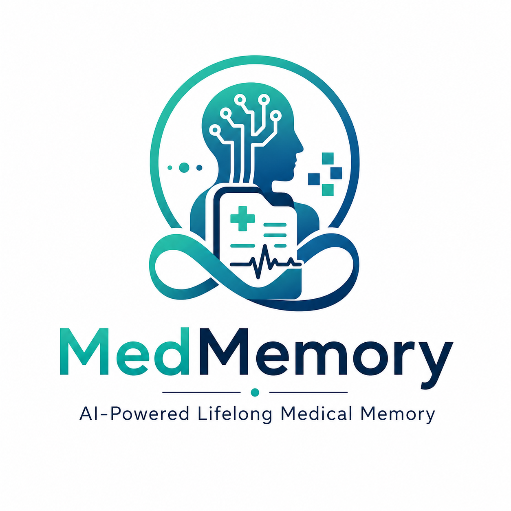

    
  
  <h1>MedMemory</h1>
  
<b>An open-source, privacy-first medical memory engine. Transform scattered health records into a structured timeline in real-time.</b>

  

    <a href="https://github.com/MedMemory-AI/frontend-app/releases/latest">Live App</a> •
    <a href="https://medmemory-ai.github.io/docs/">Documentation</a> •
    <a href="https://hub.docker.com/r/srinivasbatthula05/medmemory-backend">DockerHub Image</a> •
    <a href="https://github.com/orgs/MedMemory-AI/discussions">Discussions</a> •
    <a href="https://www.linkedin.com/in/srinivas-batthula">LinkedIn</a> •
    <a href="mailto:srinivasbatthula05.official@gmail.com">Contact</a>
  

  
   

 <h3>Repository Links :</h3>
  

      <a href="https://github.com/MedMemory-AI/MedMemory">Backend Server repo</a> •
      <a href="">Frontend App repo</a> •
      <a href="https://github.com/MedMemory-AI/docs">Centralized Docs repo</a>
  

 

## 🏥 What is MedMemory?

Healthcare records are scattered across prescriptions, lab reports, discharge summaries, imaging reports, and hospital documents. Over time, patients accumulate hundreds of files, making it difficult for both patients and doctors to quickly understand the complete medical history.

MedMemory transforms raw medical documents into a lifelong AI-powered medical memory.

Instead of storing documents as isolated PDFs, MedMemory extracts medical intelligence from them and builds a structured, searchable health timeline containing diagnoses, medications, lab results, procedures, symptoms, and treatment progression.

Patients and doctors can then interact with the entire medical history using natural language.

Ask questions like:
- When was diabetes first diagnosed?

MedMemory combines Medical NLP, Retrieval-Augmented Generation (RAG), and Longitudinal Health Intelligence to turn years of medical records into a continuously evolving digital medical memory.

The goal is simple:
> Transform healthcare documents into lifelong, searchable medical intelligence.

---

## ❌ The Problem

Today's healthcare records are fragmented.

Patients often store:

- Prescriptions
- Lab reports
- Scan reports
- Discharge summaries
- Hospital documents

across multiple hospitals, clinics, devices, emails, and cloud storage systems.

This creates several challenges:

- Doctors spend valuable time reviewing old documents.
- Important medical events are buried inside PDFs.
- Medication history is difficult to reconstruct.
- Disease progression is hard to track.
- Patients struggle to understand their own medical journey.
- Critical information may be missed during treatment.

**Healthcare data exists, but healthcare memory does not.**

---

## ✅ The Solution

MedMemory acts as an AI-powered lifelong medical memory.

The system automatically:

1. Extracts information from medical documents.
2. Identifies diseases, symptoms, medications, tests, doctors, hospitals, and dates.
3. Converts unstructured text into structured medical events.
4. Builds a chronological health timeline.
5. Stores searchable medical knowledge.
6. Enables conversational AI over the entire patient history.

Instead of searching through hundreds of documents, users simply ask questions and receive context-aware answers backed by their medical records.

This allows healthcare information to become:

- Searchable
- Understandable
- Longitudinal
- AI-accessible

---

## ✨ Core Features

### 📅 Longitudinal Health Timeline

Automatically build a lifelong chronological patient timeline of:

- Diagnoses
- Symptoms
- Medications
- Lab Results
- Procedures
- Hospital Visits
- Treatment Changes

---

### 🤖 AI Medical Chat

Ask natural language questions about patient's medical history.

Examples:

- When was diabetes diagnosed?
- Which medications were prescribed?
- Show my treatment progression.

---

### 🧠 Medical Knowledge Extraction

Extract and structure:

- Diseases
- Symptoms
- Medicines
- Dosages
- Lab Tests
- Procedures
- Doctors
- Hospitals

from unstructured medical documents.

---

### 💊 Medication Intelligence

View:

- Medication history
- Dosage changes
- Treatment changes
- Drug interactions
- Active medications

---

### 📈 Health Summary Generation

Generate AI-powered summaries of:

- Current health status
- Active conditions
- Ongoing treatments
- Recent medical events

---

### 🔍 Semantic Medical Search

Search medical history using meaning instead of exact keywords.

Find relevant information even when wording differs.

---

### 🏥 Doctor-Friendly Record Review

Provide doctors with a concise, structured view of a patient's medical journey instead of scattered documents.

---

## 🏗️ Architecture
[View Detailed Architecture](https://medmemory-ai.github.io/docs/Architecture/rag-server/)

---

## 🔁 Workflows
[View Full Workflows](https://medmemory-ai.github.io/docs/Architecture/workflows/)

---

## 📂 Folder Structure
[View Folder Structures](https://medmemory-ai.github.io/docs/Folder-Structure/)

---

## 🏗️ Tech Stack Overview
[View Tech Stacks](https://medmemory-ai.github.io/docs/Tech-Stack/)

---

## 🎯 Design Decisions
[View Design Decisions](https://medmemory-ai.github.io/docs/Design-Decisions/storage/)

---

## 📖 Guides

### How to Use
[View Guides](https://medmemory-ai.github.io/docs/Guides/how-to-use/)

### Installation / Local Setup
[View Guides](https://medmemory-ai.github.io/docs/Guides/local-setup/)

---

## 👥 Meet the Founders

MedMemory is proudly built and maintained by:

- **Srinivas Batthula [@srinivas-batthula](https://github.com/srinivas-batthula)**

- **Ashwin Tejaswi [@ashwin-tejaswi](https://github.com/ashwin-tejaswi)**

---

## 💖 Contributing

We are building a vibrant, open-source community and we'd love for you to join us! Whether you are fixing a typo, optimizing a query, or building a massive new feature, all contributions are celebrated.

1. Read our [Contributing Guide](https://github.com/MedMemory-AI/.github/main/CONTRIBUTING.md) to understand our workflow.
2. Review our [Contribution Workflow](docs/guides/contribution_workflow.md).
3. Check out our [Issues Board](https://github.com/MedMemory-AI/MedMemory/issues) and look for issues labeled `good first issue`.
4. Connect with us on [LinkedIn](https://www.linkedin.com/in/srinivas-batthula), Reach out via email at [srinivasbatthula05.official@gmail.com](mailto:srinivasbatthula05.official@gmail.com), or start a [GitHub Discussion](https://github.com/orgs/MedMemory-AI/discussions) to get help.

---

## 📜 License

MedMemory is open-source software licensed under the [MIT License](LICENSE).
